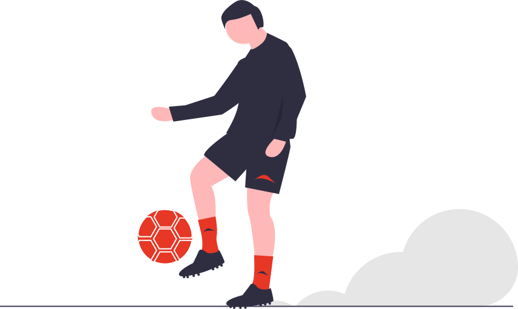

```{r, echo=FALSE}
htmltools::img(src="./images/logo3.gif",
               alt = 'logo', 
               style = 'position:absolute; top:1%; left:14%; width:60px;')
```

```{r setup, include=FALSE}
knitr::opts_chunk$set(warning = FALSE, message = FALSE ,echo=FALSE)
library(dplyr)
library(tidyr)
library(readr)
library(lubridate)
library(stringr)
library(here)
library(reactable)
library(reactablefmtr)
library(htmltools)
library(crosstalk)
library(echarts4r)
library(echarty) 
library(ggplot2)
library(sunburstR)
library(d3r)
library(g2r)
library(colorspace)
library(kableExtra)
library(visNetwork)
```

```{r,echo=FALSE}
options(encoding = 'UTF-8')
```

```{r,echo=FALSE}

#? load raw data
players_22 <-read_csv("./data/players_22.csv", locale = locale(encoding = "UTF-8"))

fifa_df <- players_22 %>%
           filter(wage_eur>22000 & overall > 75 & value_eur >= 10e6)

#? top value countries
nat_df <- read.csv('./data/nationality_comp.csv') 

#? club positions and abb.
club_pos <- read.csv('./data/club_positions.csv') %>% select(-X)

```


```{r,echo=FALSE}
source('./functions/utils.R', local = knitr::knit_global())
source('./functions/fun_country.R', local = knitr::knit_global())
source('./functions/fun_ct_player.R', local = knitr::knit_global())
source('./functions/fun_soccer_positions.R', local = knitr::knit_global())
source('./functions/fun_compare_players.R', local = knitr::knit_global())
source('./functions/fun_transfers.R', local = knitr::knit_global())
```

```{js, echo = FALSE}
// Set destination for clicks on the id tabs after page is ready
$(document).ready (
function () {

$("#tile1" ).on( 
 "click", function() {
	$('.nav-pills li a[href="#by-country"]').tab('show');
 });  

$("#tile2" ).on( 
 "click", function() {
	$('.nav-pills li a[href="#player-stats"]').tab('show');
 });

 $("#tile3" ).on( 
 "click", function() {
	$('.nav-pills li a[href="#market-values"]').tab('show');
 });

  $("#tile4" ).on( 
 "click", function() {
	$('.nav-pills li a[href="#compare-skills"]').tab('show');
 });

 $("#tile5" ).on( 
 "click", function() {
	$('.nav-pills li a[href="#soccer-positions"]').tab('show');
 });

  $("#tile6" ).on( 
 "click", function() {
	$('.nav-pills li a[href="#players-transfer"]').tab('show');
 });

});
```

#  {.unnumbered .tabset .tabset-fade .tabset-pills}

## Home {.unnumbered}


```{r,echo=FALSE}
#htmltools::includeHTML("full_screen.html")
```

<div class="div_home">

<br />

::: {#tile1 .info-tile}
[€‎24.8B]{.info-tile-large-text} <br/>
</img>
[Total value of All Countries]{.info-tile-small-text}
:::

::: {#tile2 .info-tile}
[877]{.info-tile-large-text} <br/>
</img>
[# of Top Players]{.info-tile-small-text}
:::

::: {#tile3 .info-tile}
[€71K]{.info-tile-large-text} <br/>
</img>
[Avgerage Wage of Player]{.info-tile-small-text}
:::

::: {#tile4 .info-tile}
[2909]{.info-tile-large-text} <br/>
</img>
[Max. Cumulative Skill Score]{.info-tile-small-text}
:::

::: {#tile5 .info-tile}
[€32.6M]{.info-tile-large-text} <br/>
</img>
[Attacking Player's Avg. Value]{.info-tile-small-text}
:::

::: {#tile6 .info-tile}
[€963M]{.info-tile-large-text} <br/>
</img>
[Loaned from Clubs - Total Value]{.info-tile-small-text}
:::
</div>

```{r,echo=FALSE}
htmltools::includeHTML("footer.html")
```

## By Country
```{r,echo=FALSE}
bscols(
widths = c(3, 9),
list(
  div(class= 'div_flag_tit', glue::glue('Top 10 Countries by Total Players Value')),
  div(class= 'div_flag_fans',img(src = "./images/fans.svg", width = "80%", align='center'))
  ),
list(
div(class='container_flag',
fun_card_country(1), fun_card_country(2), fun_card_country(3), fun_card_country(4), fun_card_country(5),
fun_card_country(6), fun_card_country(7), fun_card_country(8), fun_card_country(9), fun_card_country(10)
)
))

```


## Player Stats
```{r,echo=FALSE,  eval = TRUE}

# get data
fifa_sub <- fun_data()

##
cs_fifa <- SharedData$new(fifa_sub)	


row_details <- function(index) {

pl_df <- fifa_sub[index, ]
##  
   
img_src <- knitr::image_uri(sprintf("./data/player_images/%s.png",  pl_df$sofifa_id))
image <- img(src = img_src, height = "24px", alt = "")
 
detail <- div(
div(class= 'div_details', 
  bscols(
         widths = c(2, 2, 2, 2, 2, NA),
          div(fun_pp2(gauge_val = pl_df$pace, gauge_name = 'pace', r1='90%', c1='50%', c2='15%'))
        , div(fun_pp2(gauge_val = pl_df$shooting, gauge_name = 'shooting', r1='90%', c1='50%', c2='15%'))
        , div(fun_pp2(gauge_val = pl_df$passing, gauge_name = 'passing', r1='90%', c1='50%', c2='15%'))
        , div(fun_pp2(gauge_val = pl_df$dribbling, gauge_name = 'dribbling', r1='90%', c1='50%', c2='15%'))
        , div(fun_pp2(gauge_val = pl_df$defending, gauge_name = 'defending', r1='90%', c1='50%', c2='15%'))
        , div(fun_pp2(gauge_val = pl_df$physic, gauge_name = 'physic', r1='90%', c1='50%', c2='15%'))
  )  
)
)
detail
}


#Create a filter input
name_select <- filter_select("name_select", 'Name', cs_fifa, ~short_name)
club_filter <- filter_select("club_filter", 'Team', cs_fifa, ~club_name)
age_slider <- filter_slider("age_slider", "Age", cs_fifa, ~age, step=1, width=220, ticks = FALSE)
overall_slider <- filter_slider("overall_slider", "OVP", cs_fifa, ~overall, step=1, width=220, ticks = FALSE)
potential_slider <- filter_slider("potential_slider", "POT", cs_fifa, ~potential, step=1, width=220, ticks = FALSE)
value_slider <- filter_slider("value_slider", "Value", cs_fifa, ~value_eur, width=220,
                  min = 10000000, max = 200000000,
                  step = 1000000,
                  pre = "€", ticks = FALSE)
wage_slider <- filter_slider("wage_slider", "Wage", cs_fifa, ~wage_eur, width=220,
                  min = 10000, max = 400000,
                  step = 1000,
                  pre = "€", ticks = FALSE)                  


react_tab2 <- fun_ct_tab(cs_fifa)

div(
  class = "filtertext",
  bscols(
    widths = c(3, NA),
    list(      
      div(class='div_ct_club2', name_select),
      div(class='div_ct_club2', club_filter),
      div(class='div_ct_age2', age_slider),
      div(class='div_ct_ove2', overall_slider),
      div(class='div_ct_pot2', potential_slider),
      div(class='div_ct_value2',value_slider),
      div(class='div_ct_wage2',wage_slider)
    ),
    list(
    div(class='div_ct_tab2_tit', paste0('Top 200 Players by Value')),
    div(class='div_ct_tab2',react_tab2)
    )
  )
)


```

## Market Values
```{r,echo=FALSE}

##
pl_comp1 <- fifa_df %>%
            mutate(value_mil= value_eur/(1e6)) %>%
            mutate(wage_K = wage_eur/1e3) %>%
            mutate(age_bins = cut(age, breaks = c(16,18,23,30,35,38,45))) %>%            
            dplyr::select(value_mil, wage_K, short_name, nationality_name, overall, age,
            international_reputation, preferred_foot) %>%
            rename(Value_Mil = value_mil, Wage_K = wage_K, Name = short_name, 
            Nationality = nationality_name,
            OVP = overall, Age = age, International_Reputation = international_reputation,
            Preferred_Foot = preferred_foot)

sdf <- SharedData$new(pl_comp1)


##
ct_ec1 <- sdf |> ec.init( 
    height=520, animation= FALSE,
    xAxis= list(name= 'Value (€ in Million)',
        nameTextStyle= list(align= 'right', 
                    verticalAlign= 'top', padding= c(-20, 5, 0, 0))),
    yAxis= list(name= 'Wage (€ in K)'), 
    toolbox= list(feature=list(brush=list(show=TRUE))),
    brush= list(brushLink='all', throttleType='debounce', 
                brushStyle= list(borderColor='#e63946'), 
                outOfBrush= list(opacity=0.2)),
    dataZoom = list(type='inside'),
    tooltip = list(formatter= ec.clmn('Name')),
    series= list(list(
      selectedMode = 'multiple',
      select = list(itemStyle= list(color='#e63946')), 
      emphasis = list(focus='self', blurScope='series'),
      blur= list(itemStyle= list(opacity = 0.2))
    ))

    )

ct_tab2 <- DT::datatable(
            sdf,
            options = list(
                columnDefs = list(list(
                targets = c(1,2,5,6,7,8), visible = FALSE
            )), buttons = c('colvis'), dom = 'Bfrtip',
            scroller=TRUE, deferRender=TRUE, scrollY=200
            ), 
            extensions = c('Buttons','Scroller')
            )    


styl1 <- 'width:50%;display:block;float:left;font-size:80%;'
styl2 <- 'width:50%;display:block;float:left;font-size:80%;'
styl3 <- 'width:50%;display:block;float:left;font-size:80%;'
styl4 <- 'font-size:80%;'

crosstalk::bscols(
  list(br(),
    div(style=styl1,filter_slider("age_slid", "Age", sdf, ~Age, width = "85%", step=1)),
    div(style=styl1,filter_slider("ovp_slid", "OVP", sdf, ~OVP, width = "85%", step=1)),
    div(style=styl2, filter_checkbox("international_reputation", "International Reputation", sdf, ~International_Reputation, inline=TRUE)),
    div(style=styl2, filter_checkbox("preferred_foot", "Preferred Foot", sdf, ~Preferred_Foot, inline=TRUE)),
    div(style=styl3, filter_select("natioanl", "Nationality (select)", sdf, ~Nationality)),
    div(style=styl4, ct_tab2)
  ),
  list(br(), ct_ec1 )
)

```

## Compare Skills
```{r,echo=FALSE}
fun_compare_df()
```

## Soccer Positions
```{r,echo=FALSE}
bscols(
  widths = c(6, 6),
  list(
  div(class='div_s2b_tit', paste0('Player and Position Analysis')),
  fun_sun2b_fifa()), 
  list(
  div(class='div_cor_tit', paste0('Relationship Between Soccer-Specific Skills')),
  fun_position_cor())
)
```

## Players Transfer
```{r,echo=FALSE}
fun_players_transfer()
```

#  {.unnumbered}
